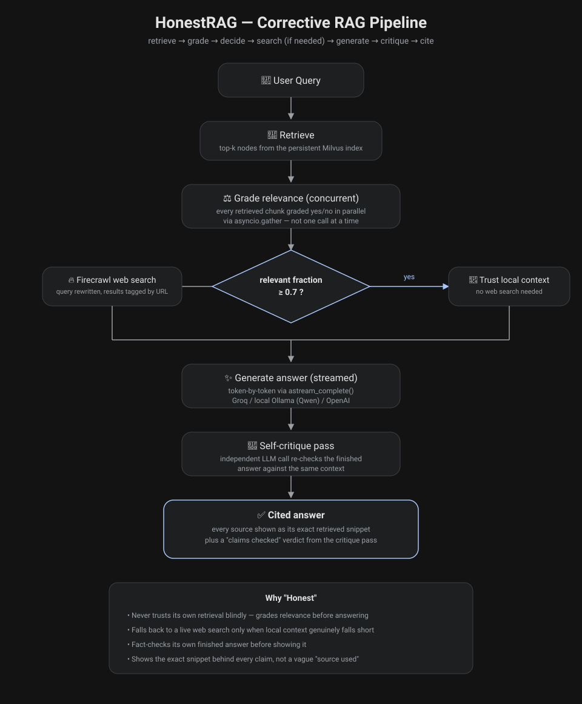

# HonestRAG

[](https://github.com/Tsk29/Honest_Rag/actions/workflows/ci.yml)
[](https://huggingface.co/spaces/tsk29/honestrag)

A Corrective RAG (Retrieval-Augmented Generation) system that doesn't just trust
its own retrieval - or its own answer. It grades the relevance of what it
pulled from your documents, falls back to a live web search (via Firecrawl)
whenever that retrieval isn't good enough to answer confidently, then
fact-checks its own finished answer against the context it used before
showing it to you, with the exact source snippet behind every claim one
click away.

*Originally forked from [patchy631/ai-engineering-hub's firecrawl-agent](https://github.com/patchy631/ai-engineering-hub/tree/main/firecrawl-agent),
then substantially rebuilt: concurrent relevance grading, a confidence-tiered
web-search trigger, a self-critique pass on every answer, per-snippet source
citations, real token streaming, a pluggable LLM layer (Groq / local Ollama /
OpenAI), multi-document persistent indexing with per-source removal, a
relevance-grader evaluation harness, and a NotebookLM-inspired UI - then
containerised with Docker, covered by an offline test suite, wired into a
GitHub Actions CI/CD pipeline, and deployed to a Hugging Face Space.*

**Live:** [huggingface.co/spaces/tsk29/honestrag](https://huggingface.co/spaces/tsk29/honestrag)
(private Space - see [Deployment](#deployment-free)).

## Features

**Corrective RAG pipeline**
- Retrieves from your uploaded documents first, never the web by default
- Grades every retrieved chunk's relevance concurrently (all nodes graded in
  parallel via `asyncio.gather`, not one LLM call at a time)
- Confidence-tiered trigger: falls back to a live Firecrawl web search only
  when the *fraction* of relevant chunks drops below a threshold, instead of
  nuking a mostly-good retrieval because one chunk out of ten was noisy
- Blends document and web context when both are used, and tells you which

**Knowledge base**
- Upload multiple PDFs at once; each is embedded (FastEmbed) and stored in a
  persistent local Milvus index that survives app restarts
- Sources panel lists every indexed document with its size and page count
- Remove a single source without touching the rest of the knowledge base, or
  wipe everything via an explicit, checkbox-gated "Clear knowledge base"

**Answers you can verify**
- Real token-by-token streaming as the LLM generates (not a fake post-hoc
  reveal) via `llm.astream_complete()`
- Every answer is tagged with the sources it actually drew on; each citation
  expands to the **exact retrieved snippet** it corresponds to - a specific
  document chunk or web result - not a generic "Uploaded source" label
- A **self-critique pass** re-checks the finished answer against that same
  context for claims it doesn't actually support, as an independent LLM call
  after the answer is generated - not the model grading its own homework in
  the same breath. Shown as a "✓ Claims checked" badge, or an expandable
  warning naming the specific unsupported claim(s) if the check fails
- Runs on Groq by default (fast, generous free tier); switch to a fully local
  model (e.g. Qwen2.5 via Ollama) or OpenAI with one environment variable -
  see [Choosing an LLM provider](#choosing-an-llm-provider)

**Interface**
- Streamlit UI restyled in a NotebookLM-inspired layout: dark theme, a
  dedicated Sources rail, a compact top bar, and an empty-state welcome card
  instead of a logo banner - used locally and in Docker
- A Gradio UI with the same features (sources panel, streaming chat, critique
  verdict, expandable citations) - what the Hugging Face Space runs. Both UIs
  share one indexing/answering layer, so they behave identically

**Engineering**
- Docker image (multi-stage, non-root, healthchecked, embedding model baked
  in) and `docker compose` with an optional local Ollama
- Offline pytest suite (46 tests, no API keys): a scripted fake LLM drives the
  whole workflow end to end; knowledge-base tests run against a real embedded
  Milvus Lite
- GitHub Actions CI/CD: lint, tests on Python 3.11 + 3.12, image build and
  boot tests on every push; versioned image, GitHub Release and Space deploy
  on every `vX.Y.Z` tag
- Knowledge base configurable between a local Milvus Lite file and a hosted
  Milvus (Zilliz Cloud) with two environment variables, no code change

**Measurement**
- A small evaluation harness (`eval/`) scores the relevance grader itself on
  a hand-labeled dataset - precision, recall, F1, accuracy - because the
  grader's yes/no call is the single most trust-critical judgment in the
  whole pipeline

## How it works

1. **Retrieve** - your query is embedded and matched against the persistent
   Milvus index of everything you've uploaded
2. **Grade** - every retrieved chunk is graded "relevant" or "not relevant" to
   your specific question, concurrently
3. **Decide** - if the relevant fraction clears the threshold, retrieval is
   trusted as-is; otherwise the query is rewritten and sent to Firecrawl for a
   live web search
4. **Generate** - the LLM answers from whichever context survived (document,
   web, or both), streaming tokens back as they're produced
5. **Critique** - once the answer is complete, a second, independent LLM call
   checks it against that same context for unsupported claims
6. **Cite** - the answer is returned with the specific sources - and exact
   snippets - it drew on, plus the critique verdict, so you can check its
   work instead of taking it on faith



## Tech Stack

| Layer | Choice |
|---|---|
| RAG framework | [LlamaIndex](https://github.com/run-llama/llama_index) (Workflow-based orchestration) |
| LLM | [Groq](https://groq.com/) by default; [Ollama](https://ollama.com/) (local) or OpenAI via `LLM_PROVIDER` |
| Web search | [Firecrawl](https://firecrawl.dev/) |
| Vector store | [Milvus](https://milvus.io/) - Milvus Lite (local file) or [Zilliz Cloud](https://zilliz.com/cloud) (hosted) |
| Embeddings | [FastEmbed](https://github.com/qdrant/fastembed) (`BAAI/bge-large-en-v1.5`) |
| UI | [Streamlit](https://streamlit.io/) (local / Docker), [Gradio](https://www.gradio.app/) (Hugging Face Space) |
| Packaging | [uv](https://docs.astral.sh/uv/) lockfile, Docker, Docker Compose |
| CI/CD | GitHub Actions, GitHub Container Registry, Dependabot |
| Hosting | [Hugging Face Spaces](https://huggingface.co/spaces) (free ZeroGPU hardware) |

## Setup and Installation

### Prerequisites

- Python 3.11+
- A [Firecrawl](https://firecrawl.dev/) API key
- A [Groq](https://console.groq.com/) API key, **or** a locally running
  [Ollama](https://ollama.com/) instance if you'd rather not use an API key
  at all - see [Choosing an LLM provider](#choosing-an-llm-provider)

> Just want to run it? Skip to [Running with Docker](#running-with-docker).

### 1. Install dependencies

`pyproject.toml` declares the dependencies and `uv.lock` pins every
transitive version - the same lockfile Docker and CI install from, so local,
CI and container environments are identical:

```bash
uv sync --all-extras          # .venv with app, dev tools and the Gradio UI
```

Or with plain pip (`requirements.txt` is exported from `uv.lock`):

```bash
python3 -m venv .venv && source .venv/bin/activate
pip install -r requirements.txt
```

### 2. Configure environment variables

```bash
cp .env.example .env
```

Then fill in at least:

```bash
FIRECRAWL_API_KEY="your_firecrawl_api_key_here"
GROQ_API_KEY="your_groq_api_key_here"
GROQ_MODEL="openai/gpt-oss-120b"  # optional, defaults to this
```

Groq's available model lineup changes fairly often - if `GROQ_MODEL` starts
erroring out as deprecated, check what's currently live at
`https://api.groq.com/openai/v1/models`.

### Choosing an LLM provider

Both the answer-generation LLM and the relevance grader are built through a
single factory (`llm_provider.py`), switched with one variable:

```bash
LLM_PROVIDER=groq     # default - needs GROQ_API_KEY, GROQ_MODEL optional
LLM_PROVIDER=ollama   # fully local - needs a running `ollama serve`
LLM_PROVIDER=openai   # needs OPENAI_API_KEY, OPENAI_MODEL optional (default gpt-4o)
```

**Running fully local with Qwen (or any other Ollama model):**

```bash
ollama pull qwen2.5:7b        # or qwen2.5-coder:1.5b for a smaller/faster pull
```

```bash
LLM_PROVIDER=ollama
OLLAMA_MODEL="qwen2.5:7b"        # optional, defaults to qwen2.5-coder:1.5b
OLLAMA_BASE_URL="http://localhost:11434"  # optional, this is the default
```

No API key needed for this path - everything (retrieval grading, web-search
query rewriting, answer generation, self-critique) runs against your local
Ollama server instead. Expect it to be slower and less reliable at following
the grading/critique prompts than Groq's larger hosted models, especially
with a small model like `qwen2.5-coder:1.5b` - but it costs nothing and needs
no network access beyond Firecrawl's web-search fallback.

### 3. Run it

```bash
streamlit run app.py
```

Open the local URL Streamlit prints (default `http://localhost:8501`), add a
PDF or two in the Sources panel, and start asking questions.

## Running with Docker

```bash
cp .env.example .env          # add FIRECRAWL_API_KEY + GROQ_API_KEY
docker compose up --build
```

Open `http://localhost:8501`. The vector store lives in the `honestrag-data`
volume (mounted at `/data`), so your knowledge base survives restarts and
image rebuilds; `docker compose down -v` wipes it. The ~1.3 GB embedding
model is baked into the image, so uploads work immediately with no download.

Fully local, no LLM API key - adds an Ollama container:

```bash
LLM_PROVIDER=ollama docker compose --profile ollama up --build -d
docker compose exec ollama ollama pull qwen2.5-coder:1.5b
```

Or run a released image without cloning the repo:

```bash
docker run -p 8501:8501 --env-file .env -v honestrag-data:/data ghcr.io/tsk29/honestrag:latest
```

**Image details:** two-stage build (dependencies installed from `uv.lock` and
the embedding model downloaded in a builder stage; only the venv, model and
source copied into a slim runtime - about 3.5 GB, most of it the model), runs as
a non-root user, `HEALTHCHECK` on Streamlit's `/_stcore/health`, OCI labels
carrying the version and git SHA, and secrets are only ever injected at
runtime - `.env` is excluded from the build context.

## Testing

```bash
uv run pytest                          # unit + workflow tests
uv run ruff check .                    # lint
uv run python eval/run_eval.py --mock  # eval-harness smoke test
```

No test calls a real LLM, Firecrawl or a hosted Milvus (the knowledge-base
tests use a throwaway embedded Milvus Lite file). `tests/conftest.py` provides a
scripted fake LLM that answers each of the workflow's prompts (grader, query
rewrite, answer, critique) deterministically, so the whole
`CorrectiveRAGWorkflow` can be run end to end in CI without API keys - covering
the relevance-threshold routing (local vs. web fallback), token streaming,
source attribution, the self-critique verdict, and failure fallbacks.

## CI/CD

`.github/workflows/ci.yml` runs on every push to `main`, every pull request,
and every version tag:

| Stage | Runs on | What it does |
|---|---|---|
| **lint** | everything | `uv lock --check` (lockfile matches `pyproject.toml`) and `ruff check` |
| **test** | everything | pytest on Python 3.11 and 3.12 from the locked environment, eval harness in mock mode, JUnit report uploaded as an artifact |
| **docker** | everything | builds the image; checks all dependencies import, the baked embedding model loads with networking disabled, and the container boots healthy as a non-root user |
| **publish** | `vX.Y.Z` tags | checks the tag matches `pyproject.toml`'s version, pushes `X.Y.Z`, `X.Y` and `latest` (linux/amd64) to GHCR |
| **release** | `vX.Y.Z` tags | creates a GitHub Release with auto-generated notes |
| **deploy** | `vX.Y.Z` tags | pushes the Gradio app at that tag to the Hugging Face Space and waits until it is running ([`deploy.yml`](.github/workflows/deploy.yml)) |

`main` is always verified but only a tag ships. Dependabot opens monthly
update PRs for Python packages, GitHub Actions and the base image, each of
which goes through the same pipeline.

Cutting a release:

```bash
# bump `version` in pyproject.toml, commit, then:
git tag v0.2.0 && git push origin v0.2.0
```

## Deployment (free)

The app runs on a **private Hugging Face Space** -
[`tsk29/honestrag`](https://huggingface.co/spaces/tsk29/honestrag) - on the
free tier, for $0/month.

```
git tag vX.Y.Z → CI: lint, tests, Docker build ─→ deploy.yml pushes the Gradio app → HF Space
                                                                                      │
                                                  Groq · Firecrawl ◄───────────────────┼──► Zilliz Cloud (optional)
```

- **Two UIs, one pipeline.** Free Spaces host Gradio apps but not Docker
  ones (Docker Spaces are paid), so the Space runs `gradio_app.py`; local and
  Docker use keep the Streamlit UI (`app.py`). Both call the same
  `rag_service.py` for indexing and the same `workflow.py` for answering, so
  they can't drift apart in behaviour - only the presentation differs.
- **ZeroGPU hardware.** On a free account, Gradio Spaces run on ZeroGPU (the
  plain CPU tier needs PRO). HonestRAG needs no GPU - embeddings run on CPU
  via ONNX and the LLM is Groq's API - so it uses none of the daily GPU quota.
  ZeroGPU only supports Python 3.10.13 / 3.12.12, so the Space uses 3.12.12,
  and it expects one `@spaces.GPU` function at startup, which `gradio_app.py`
  registers as a never-called placeholder.
- **Tested versions only.** The Space's `requirements.txt` is exported from
  `uv.lock`, with Gradio pinned to the same version. The Space builder also
  installs `gradio[oauth,mcp]` and `spaces` on top, so those are locked in the
  `space` extra too - otherwise the lockfile can pin versions the builder's
  extras reject (this happened with `pydantic`).
- **Same code, different config.** With no `HONESTRAG_MILVUS_URI` set, the
  Space stores vectors in a Milvus Lite file inside the container, which is
  wiped when the Space restarts or sleeps. Pointing `HONESTRAG_MILVUS_URI` /
  `HONESTRAG_MILVUS_TOKEN` at a free Zilliz Cloud cluster makes uploads
  permanent. The Sources list is read from the vector store itself
  (`knowledge_base.py`), so there is no other state to lose.
- **Rollback:** Actions → *Deploy* → *Run workflow* with an earlier tag.

Run the Gradio UI locally:

```bash
uv sync --all-extras
uv run python gradio_app.py        # http://localhost:7860
```

### One-time setup

1. **Hugging Face** (free): create a new Space with SDK **Gradio** (Blank
   template), hardware **ZeroGPU**, visibility **Private**. In its
   *Settings → Variables and secrets*, add the secrets `GROQ_API_KEY` and
   `FIRECRAWL_API_KEY`. Create an access token with **write** permission.
2. **Zilliz Cloud** (optional, free): create a free cluster and add its
   public endpoint and API key as the Space secrets `HONESTRAG_MILVUS_URI`
   and `HONESTRAG_MILVUS_TOKEN`, so uploads survive restarts.
3. **GitHub repo** → *Settings → Secrets and variables → Actions*: add the
   secret `HF_TOKEN` (that token) and the variable `HF_SPACE`
   (e.g. `tsk29/honestrag`).
4. Push a tag (see *Cutting a release*). The deploy job replaces the Space's
   files and waits until it reports `RUNNING`.

The current Space was first deployed by uploading the same generated files
(the output of `deploy.yml`'s *Assemble Space* step) through the Space's web
UI; later releases go through the pipeline.

Keep the Space **private**: the app has no login, so a public URL would let
anyone spend your Groq/Firecrawl quota and see every uploaded document (all
visitors share one knowledge base). Free Spaces sleep after ~48 h without
visitors and take about a minute to wake. The first question after a restart
also downloads the embedding model (~1.3 GB, fast from inside Hugging Face).

## Project Structure

```
Honestrag/
├── app.py                 # Streamlit UI (local / Docker): sources panel, chat, streaming
├── workflow.py             # CorrectiveRAGWorkflow: retrieve/grade/search/answer/critique
├── llm_provider.py          # Shared LLM factory (Groq / Ollama / OpenAI)
├── gradio_app.py            # Gradio UI - what the Hugging Face Space runs
├── rag_service.py           # Indexing + workflow wiring shared by both UIs
├── knowledge_base.py        # Milvus connection (Lite file or Zilliz) + source list
├── eval/
│   ├── dataset.jsonl        # Labeled examples for the relevance grader
│   └── run_eval.py          # Precision/recall/F1 harness for the grader
├── tests/                   # Offline pytest suite (fake LLM, no API keys)
├── Dockerfile               # Multi-stage, non-root, healthchecked image
├── docker-compose.yml       # App + optional local Ollama, persistent volume
├── .github/workflows/
│   ├── ci.yml               # Lint -> test -> build/smoke -> publish -> release -> deploy
│   └── deploy.yml           # Deploy (or roll back) a release tag to the HF Space
├── pyproject.toml / uv.lock # Dependencies (source of truth) + exact pins
├── requirements.txt         # pip-compatible export of uv.lock
├── .env.example             # Every supported environment variable
├── start_server.py          # Optional Beam Cloud deployment (unmodified from
│                             #   upstream; not part of the local Groq setup above)
└── assets/architecture.svg   # Pipeline diagram used in this README
```

## Configuration

- **LLM provider**: `LLM_PROVIDER` in `.env` (`groq` / `ollama` / `openai`) -
  see [Choosing an LLM provider](#choosing-an-llm-provider); resolved once in
  `llm_provider.py` and used by both the UI and the workflow
- **Relevance threshold**: `CorrectiveRAGWorkflow.RELEVANCE_TRIGGER_THRESHOLD`
  in `workflow.py` (default `0.7`) - the minimum fraction of retrieved chunks
  that must grade "relevant" before local retrieval is trusted without a web
  search
- **Self-critique**: always on, adds one extra (non-streamed) LLM call after
  each answer; see `_critique_answer()` in `workflow.py` to disable or adjust
  its prompt
- **Embedding model**: FastEmbed, `BAAI/bge-large-en-v1.5` by default
- **Vector store**: `HONESTRAG_MILVUS_URI` / `HONESTRAG_MILVUS_TOKEN` - unset means a local
  Milvus Lite file; set them to use a hosted Milvus such as Zilliz Cloud
- **Data location**: `HONESTRAG_DATA_DIR` (default `.`; `/data` in Docker)
  holds the local `milvus_demo.db` and `hf_cache/` - gitignored, local only

## Troubleshooting

1. **API key errors** - confirm `FIRECRAWL_API_KEY` and `GROQ_API_KEY` are set
   in `.env` and that the process picked it up (`load_dotenv()` runs at
   startup)
2. **`GROQ_MODEL` not found / deprecated** - check
   `https://api.groq.com/openai/v1/models` for the current live model list
3. **`ModuleNotFoundError`** - reinstall from the lockfile (`uv sync`, or
   `pip install -r requirements.txt`); both now include every package the
   app imports
4. **Vector store looking stale or corrupted** - use *Danger zone → Clear
   knowledge base* in the app, then re-upload your documents
5. **`Illegal uri ... expected form 'http[s]://...'` from pymilvus** - a plain
   `MILVUS_URI` variable is set somewhere. pymilvus reads that name itself at
   import time; HonestRAG uses `HONESTRAG_MILVUS_URI` instead
6. **Hugging Face Space build fails with `ResolutionImpossible`** - the
   Space's `requirements.txt` conflicts with the `gradio[oauth,mcp]` / `spaces`
   packages the builder adds. Regenerate it from `uv.lock` (which locks those
   too) rather than editing it by hand
7. **`[SSL: CERTIFICATE_VERIFY_FAILED]` downloading NLTK data on macOS** - the
   python.org installer ships without certificates; run *Install
   Certificates.command* from the Python folder in Applications, or set
   `SSL_CERT_FILE=$(python -m certifi)`

## Evaluation

The Corrective RAG behavior in this app hinges on one judgment: for each
retrieved document chunk, the relevance grader (`DEFAULT_RELEVANCY_PROMPT_TEMPLATE`
in `workflow.py`) decides "yes" or "no" on whether that chunk is actually
relevant to the user's question. That decision determines whether the app
trusts local retrieval or falls back to a Firecrawl web search - it's the
single most trust-critical judgment in the pipeline.

`eval/` contains a small evaluation harness for that grader:

- `eval/dataset.jsonl` - ~20 hand-written labeled examples (`query`,
  `document_chunk`, `label`), including obviously relevant/irrelevant cases
  and several deliberately tricky near-misses (chunks that share keywords
  with the query but don't actually answer it, or are topically adjacent but
  not on-point). The easy cases don't tell you much about grader quality -
  the near-misses do.
- `eval/run_eval.py` - loads the dataset, imports the real
  `DEFAULT_RELEVANCY_PROMPT_TEMPLATE` from `workflow.py` (never reimplements
  it), runs it through an LLM, parses yes/no the same way the workflow does
  (including stripping `<think>` blocks), and reports precision, recall, F1,
  and accuracy - plus prints every misclassified example so you can see
  *which* cases the grader gets wrong, not just an aggregate score.

### Running it for real

The grading LLM comes from the same `build_llm()` factory the app itself
uses (`llm_provider.py`), so the harness follows whatever `LLM_PROVIDER` is
already set in `.env` - the default is Groq, so in most cases no extra
credential is needed beyond what the app already requires:

```bash
python eval/run_eval.py
```

To evaluate against a fixed, independent baseline model instead of whatever
the app happens to be configured with:

```bash
LLM_PROVIDER=openai OPENAI_API_KEY="your_openai_api_key_here" python eval/run_eval.py
```

`--dataset` points at a different labeled file if needed.

Sample run against the default Groq provider (`openai/gpt-oss-120b`), 20
examples: **accuracy 0.900, precision 0.833, recall 1.000, F1 0.909** (2
false positives, 0 false negatives) - the grader never let a truly relevant
chunk go unrecognized, but on 2 of the 20 examples called a topically-close
but non-answering chunk "relevant" when it wasn't.

### Mock mode

```bash
python eval/run_eval.py --mock
```

`--mock` (also triggered automatically if no credentials are found for the
active `LLM_PROVIDER`) swaps in a crude deterministic keyword-overlap
heuristic instead of a real LLM call. It exists solely so the harness's own
plumbing - dataset loading, prompt formatting, and metrics computation - can
be verified without an API key. Mock-mode numbers say nothing about the real
grader's quality; only a run with real provider credentials is a meaningful
evaluation.

## Changelog

**Containerisation, CI/CD and deployment**
- Dependencies: `pyproject.toml` + `uv.lock` became the single source of
  truth; added the packages the app imported but never declared (Milvus
  vector store, Groq), removed unused ones, and export `requirements.txt`
  from the lockfile
- Docker: multi-stage image, non-root user, healthcheck, embedding model
  baked in and loaded offline; `docker-compose.yml` with a persistent volume
  and optional Ollama
- Tests: new offline pytest suite covering the CRAG workflow (threshold
  routing, streaming, citations, critique, failure fallbacks), the LLM
  factory, the eval harness, the knowledge base and both UIs
- CI/CD: GitHub Actions pipeline (lint → test → Docker build and smoke tests
  → GHCR publish → GitHub Release → Hugging Face deploy), manual
  deploy/rollback workflow, Dependabot
- Knowledge base: source list now read from the vector store instead of a
  JSON manifest; hosted Milvus supported via `HONESTRAG_MILVUS_URI` /
  `HONESTRAG_MILVUS_TOKEN`; page counts stored at index time
- New `rag_service.py` shared by the Streamlit app and the new Gradio app
- Fixes: *Clear knowledge base* crashed on Milvus Lite 3 (the store is now a
  directory, and it was deleted as a file) - it now drops the collection;
  the Streamlit app reloaded the 1.3 GB embedding model on every upload - it
  is now loaded once per process
- Deployed to a private Hugging Face Space on free ZeroGPU hardware

## Acknowledgments

- [patchy631/ai-engineering-hub](https://github.com/patchy631/ai-engineering-hub/tree/main/firecrawl-agent) for the original firecrawl-agent this was forked from
- [LlamaIndex](https://github.com/run-llama/llama_index) for the RAG framework
- [Firecrawl](https://firecrawl.dev/) for web search
- [Groq](https://groq.com/) for LLM inference
- [Milvus](https://milvus.io/) for vector storage
- [Streamlit](https://streamlit.io/) for the web interface
